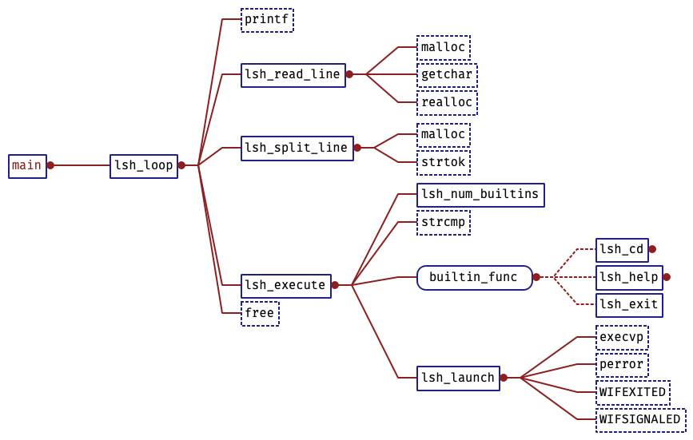

# README

学习到了如何写一个 shell，感觉还是挺有意思的。

原博客地址：https://brennan.io/2015/01/16/write-a-shell-in-c/

就是当我在学习写一个库的时候，我或许会递归的看这个库。

这里的 shell，主要也就是 3 个功能：

1. 读取一行命令
2. parse 命令，将一行字符串拆分成一个 token 一个 token 的
3. 运行命令，运行命令又有两种情况
   1. 内置命令，有三条命令是内置的（比方说 bash: which cd --> cd: shell built-in command）
      1. cd
      2. help
      3. exit
   2. 调用环境变量中的工具，主要是一条指令，execvp

用 understand 分析的调用关系如下：

